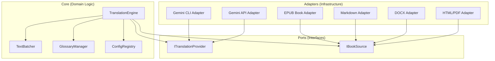

# SPEC-012: Core Translation Engine Refactor (Hexagonal Architecture)

## 1. Goal

> Re-architect the BookWeaver translation logic into a **Hexagonal (Ports & Adapters)** structure to eliminate code duplication, unify the "Immersive Translate" style batching/retry logic, and provide a stable foundation for multiple document formats (EPUB, Markdown, DOCX, HTMLz, PDF, etc.) and translation providers.

## 1.1 Implementation Status Snapshot (2026-03-29)

- ✅ Hexagonal vertical slices are running for **EPUB + Markdown + PDF** through `ai/cli.py`.
- ✅ Core pieces exist and are production-used: `ai/core/batcher.py`, `ai/core/engine.py`, `ai/ports/*`, `ai/adapters/*`.
- ✅ Glossary constraints (SPEC-010) are wired in new CLI flow, including EPUB-only auto extraction (`--extract-glossary`).
- ✅ Architecture boundary checks are defined in `tach.toml` and pass locally via `uv run tach check`.
- ✅ `tach check` is enforced in CI (`.github/workflows/lint.yml`).
- ✅ Legacy translation scripts (`03_translate_md.py`, `09_epub_translate_roundtrip.py`) have been strangled and removed; `translatebook.sh` routes to `python -m ai.cli`.
- ⚠️ Optional hardening backlog remains (strict/tag Tach policy and extra source adapters like DOCX/HTML).

## 2. Problem Statement

### 2.1 Current "Messy" Architecture
- **Duplicated Logic**: `03_translate_md.py` (Markdown workflow) and `ai/epub_translate_roundtrip.py` (EPUB workflow) both implement separate retry, rate-limiting, and chunking logic.
- **Tangled Responsibilities**: Business logic (how to batch paragraphs with `%%`) is mixed with infrastructure (how to call `gemini` CLI or parse EPUB ZIPs).
- **Prompt Fragmentation**: Prompt templates are partially in `config/prompts/*.txt` and partially hardcoded in `ai/` modules.
- **Architectural Drift**: As an AI-assisted project, it is prone to "local optimization" where quick fixes introduce hidden coupling and circular dependencies.

### 2.2 Critical Need for Architectural Governance
Following the research on **Python Architectural Drift**, the project needs automated enforcement to ensure that AI-generated code respects domain boundaries.

## 3. Proposed Hexagonal Design

### 3.1 Structural Overview

The system is divided into three logical layers:



### 3.2 Directory Structure (Target)

```
ai/
├── core/                   # 核心领域逻辑 (Core Domain)
│   ├── engine.py           # TranslationEngine (Orchestrator)
│   ├── batcher.py          # TextBatcher (Segment logic)
│   ├── glossary.py         # Glossary injection logic
│   └── config.py           # Centralized ConfigRegistry
├── ports/                  # 定义接口 (Interfaces)
│   ├── provider.py         # ITranslationProvider interface
│   └── source.py           # IBookSource interface
├── adapters/               # 基础设施实现 (Implementation)
│   ├── providers/          # CLI / API implementations
│   └── sources/            # EPUB / Markdown / DOCX / HTML implementations
└── shared/                 # 通用工具 (Shared Utils)
```

### 3.3 The Ports (Interfaces)

#### `ITranslationProvider`
```python
class ITranslationProvider(ABC):
    @abstractmethod
    def translate(self, text: str, target_lang: str) -> str:
        """Translate text string using the underlying AI model."""
```

#### `IBookSource`
```python
class IBookSource(ABC):
    @abstractmethod
    def get_segments(self) -> Iterable[Segment]:
        """Yield translatable units from the source book."""
    
    @abstractmethod
    def save_segments(self, segments: Iterable[Segment]) -> None:
        """Persist translated segments back to the source."""
```

### 3.4 The Core (Domain)
- **`TranslationEngine`**: The only place that knows the "High-Level State Machine" (Prepare -> Batch -> Translate -> Retry -> Save).
- **`TextBatcher`**: Implements the `%%` delimiter logic and batching constraints (e.g., max 60k chars per batch).
- **`ConfigRegistry`**: Single source of truth for loading `config.json` and external prompts.

## 4. Architectural Governance (Arch-Test)

### 4.1 Automated Enforcement with `Tach`
Following our discussions, we will use **Tach** (a Rust-based, modern modularity and strict interface enforcer) instead of traditional linters. Tach provides zero-runtime overhead and enforces strict boundaries for our hexagonal architecture.

Current governance features in use:
1.  **Incremental Adoption**: boundaries are enforced for `ai.ports`, `ai.core`, `ai.adapters`, and `ai.shared`, while legacy files are excluded during migration.
2.  **Dependency Direction Rules**: Core depends only on Ports; Adapters depend only on Ports; circular dependencies are forbidden.
3.  **CI Enforcement**: `uv run tach check` runs in the `lint-and-test` GitHub Actions workflow before lint/test jobs continue.
4.  **Future Hardening (Optional)**: `strict: true` and tag-based rules are tracked as a follow-up tightening step, not a blocker for this SPEC closeout.

### 4.2 Configuration (`tach.toml`)
```toml
exclude = ["tests/", "docs/", "venv/", ".venv/", "tmp/"]
source_roots = ["."]
forbid_circular_dependencies = true

[[modules]]
path = "ai.ports"
depends_on = []

[[modules]]
path = "ai.core"
depends_on = ["ai.ports"]

[[modules]]
path = "ai.adapters"
depends_on = ["ai.ports"]
```

## 5. Unit Testing Strategy

Following the principles of **Vladimir Khorikov's "Unit Testing Principles, Practices, and Patterns"**, we will adopt a strict unit testing strategy during this refactoring process:

### 5.1 Focus on the Core Domain
- **Test the `ai/core/` extensively**: The Translation Engine, Text Batcher, and Glossary logic represent the complex business domain. These should have high test coverage.
- **Mocks at the Edges**: Only use mocks at the very edges of the system (i.e., mocking `ITranslationProvider` and `IBookSource` interfaces). Do not mock internal core components when testing the engine.

### 5.2 Observable Behavior over Implementation Details
- **Test against the Public API**: Tests should target the public interfaces of the `ai/core` modules, not their private helper functions. This ensures tests do not break when internal implementations are refactored (reducing false positives/fragile tests).
- **Value-Based Verification**: Ensure the `TranslationEngine` correctly coordinates state transitions and produces the expected output segments, without verifying exactly how many times a private method was called.

### 5.3 Refactoring Existing Tests
- Existing unit tests tightly coupled to `epub_translate_roundtrip.py` or `03_translate_md.py` will be broken down and migrated to target the new `ai/core/` and `ai/adapters/` components.
- Tests will be reorganized to match the new hexagonal directory structure:
  - `tests/unit/core/`
  - `tests/unit/adapters/`

### 5.4 Preserving Functional Coverage (The 120+ Tests Baseline)
Given the project already has 120+ unit tests providing a strong safety net, we must ensure this functional coverage is not lost during the architectural shift. We will adopt the following strategies:
- **Baseline Verification**: Before any code is changed, we will run the full test suite with coverage reporting (`pytest --cov`) to establish a baseline.
- **Dual-Targeting (Parallel Implementation)**: Instead of deleting old code immediately, we will build the new `ai/core/` alongside the existing `ai/epub_translate_roundtrip.py`. We will duplicate the most critical E2E and high-level tests to run against *both* the old and new implementations using the exact same inputs and expecting the exact same outputs.
- **Incremental Test Migration**: As we migrate logic to `ai/core/`, we will port the corresponding tests. A test is only removed from the "legacy" test suite when its functional equivalent in the new `tests/unit/core/` or `tests/unit/adapters/` suite is passing.
- **Coverage Parity**: The refactoring PR must prove that the overall test coverage percentage has not dropped compared to the baseline, ensuring no edge cases from the 120+ original tests were left behind.

## 6. Implementation Phases

### Phase 1: Foundation (Config & Ports)
- [x] Implement `ai/core/config.py` (Unified ConfigRegistry).
- [x] Define `ai/ports/provider.py` and `ai/ports/source.py`.
- [x] Refactor provider access into `ai/adapters/providers/` (adapter wrappers in place; legacy raw providers retained under `ai/` for compatibility).

### Phase 2: Core Engine Refactor
- [x] Move batching responsibilities from legacy script into new architecture. *(delimiter protocol now in `ai/adapters/providers/_delimiter.py`; size batch planning in `ai/core/batcher.py`)*
- [x] Implement `ai/core/engine.py` using the Batcher and Provider Port.
- [x] Move Glossary logic to `ai/core/glossary.py` (legacy modules now act as compatibility facades).

### Phase 3: Adapter Migration
- [x] Implement `ai/adapters/sources/epub_adapter.py` (wrapping `epub_package.py`).
- [x] Implement `ai/adapters/sources/markdown_adapter.py`.
- [x] Implement first non-EPUB adapter (`ai/adapters/sources/pdf_adapter.py`) and route `.pdf` in `ai/cli.py`. *(DOCX/HTML deferred to follow-up)*
- [x] Complete strangler migration by deleting legacy translation scripts and routing shell orchestration to `python -m ai.cli`.

### Phase 4: Arch-Test & Cleanup
- [x] Install `tach` framework.
- [x] Create and maintain baseline `tach.toml`.
- [ ] Configure `strict: true` and tag-based rules in `tach.toml` to enforce Hexagonal boundaries. *(optional hardening backlog)*
- [x] Run `tach check` in CI. *(added to `.github/workflows/lint.yml`)*
- [x] Remove redundant code in legacy scripts.

### Phase 4.1: Architecture Test Definition (Current)
- **Where defined**: `tach.toml` at repository root (module dependency boundaries).
- **How to run locally**: `uv run tach check`.
- **Current state**: passes locally and in CI workflow (`lint-and-test`).
- **Optional follow-up only**:
  - Add a pytest wrapper (e.g. `tests/integration/test_architecture.py`) if we want architecture checks surfaced under pytest output as well.
  - Tighten Tach with strict/tag policies after remaining legacy compatibility concerns are retired.

## 6. Success Metrics
- **Zero Redundancy**: Retry/Batching logic exists only in `ai/core/`.
- **High Testability**: `TranslationEngine` can be unit-tested without calling a real API (using mocks).
- **Strong Boundaries**: `tach check` passes in CI, enforcing strict interfaces.
- **Consistent Quality**: Markdown, EPUB, and other formats use identical prompt templates and glossary injection.

## 8. Risks & Mitigations
- **Complexity Overhead**: For a small tool, Hexagonal can feel like "too many files."
  - *Mitigation*: Keep implementations simple. Focus on "isolation" over "abstraction for the sake of abstraction."
- **Performance**: Double-wrapping segments might add overhead.
  - *Mitigation*: Ensure adapters use lazy loading/iterators where possible.

## 9. Closeout Decision (2026-03-29)

- ✅ SPEC-012 is considered **completed for the targeted migration scope**:
  - Hexagonal core + ports/adapters are live and tested.
  - Translation orchestration is unified in `ai/cli.py`.
  - Legacy translation scripts were removed after test migration.
  - Architecture boundaries are enforced in CI via Tach.
- 📝 Remaining items are classified as **post-SPEC hardening/backlog**, not release blockers:
  - stricter Tach/tag policy,
  - optional architecture pytest wrapper,
  - additional source adapters (DOCX/HTML).

---
**End of SPEC-012**
