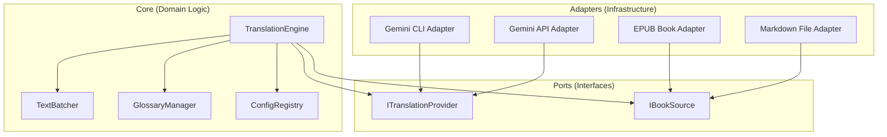

# SPEC-012: Core Translation Engine Refactor (Hexagonal Architecture)

## 1. Goal

> Re-architect the BookWeaver translation logic into a **Hexagonal (Ports & Adapters)** structure to eliminate code duplication, unify the "Immersive Translate" style batching/retry logic, and provide a stable foundation for multiple document formats and translation providers.

## 2. Problem Statement

### 2.1 Current "Messy" Architecture
- **Duplicated Logic**: `03_translate_md.py` (Markdown workflow) and `ai/epub_translate_roundtrip.py` (EPUB workflow) both implement separate retry, rate-limiting, and chunking logic.
- **Tangled Responsibilities**: Business logic (how to batch paragraphs with `%%`) is mixed with infrastructure (how to call `gemini` CLI or parse EPUB ZIPs).
- **Prompt Fragmentation**: Prompt templates are partially in `config/prompts/*.txt` and partially hardcoded in `ai/` modules.
- **Architectural Drift**: As an AI-assisted project, it is prone to "local optimization" where quick fixes introduce hidden coupling and circular dependencies.

### 2.2 Critical Need for Architectural Governance
Following the research on **Python Architectural Drift**, the project needs automated enforcement to ensure that AI-generated code respects domain boundaries.

## 3. Proposed Hexagonal Design

### 3.1 Structural Overview

The system is divided into three logical layers:



### 3.2 Directory Structure (Target)

```
ai/
├── core/                   # 核心领域逻辑 (Core Domain)
│   ├── engine.py           # TranslationEngine (Orchestrator)
│   ├── batcher.py          # TextBatcher (Segment logic)
│   ├── glossary.py         # Glossary injection logic
│   └── config.py           # Centralized ConfigRegistry
├── ports/                  # 定义接口 (Interfaces)
│   ├── provider.py         # ITranslationProvider interface
│   └── source.py           # IBookSource interface
├── adapters/               # 基础设施实现 (Implementation)
│   ├── providers/          # CLI / API implementations
│   └── sources/            # EPUB / Markdown / DOCX implementations
└── shared/                 # 通用工具 (Shared Utils)
```

### 3.3 The Ports (Interfaces)

#### `ITranslationProvider`
```python
class ITranslationProvider(ABC):
    @abstractmethod
    def translate(self, text: str, target_lang: str) -> str:
        """Translate text string using the underlying AI model."""
```

#### `IBookSource`
```python
class IBookSource(ABC):
    @abstractmethod
    def get_segments(self) -> Iterable[Segment]:
        """Yield translatable units from the source book."""
    
    @abstractmethod
    def save_segments(self, segments: Iterable[Segment]) -> None:
        """Persist translated segments back to the source."""
```

### 3.4 The Core (Domain)
- **`TranslationEngine`**: The only place that knows the "High-Level State Machine" (Prepare -> Batch -> Translate -> Retry -> Save).
- **`TextBatcher`**: Implements the `%%` delimiter logic and batching constraints (e.g., max 60k chars per batch).
- **`ConfigRegistry`**: Single source of truth for loading `config.json` and external prompts.

## 4. Architectural Governance (Arch-Test)

### 4.1 Automated Enforcement with `Import-Linter`
We will use `Import-Linter` to ensure that:
1.  **Core is Pure**: `ai/core/` cannot import from `ai/adapters/`.
2.  **Layers are Respected**: Infrastructure (Adapters) must only depend on Ports.
3.  **No Circular Dependencies**: No circular imports between modules.

### 4.2 Configuration (`.importlinter`)
```ini
[importlinter]
root_package = ai

[importlinter:contract:layers]
name = Layered Architecture
type = layers
layers =
    ai.adapters
    ai.ports
    ai.core
```

## 5. Implementation Phases

### Phase 1: Foundation (Config & Ports)
- [ ] Implement `ai/core/config.py` (Unified ConfigRegistry).
- [ ] Define `ai/ports/provider.py` and `ai/ports/source.py`.
- [ ] Refactor existing `GeminiProvider` into `ai/adapters/providers/`.

### Phase 2: Core Engine Refactor
- [ ] Move `%%` batching logic from `epub_translate_roundtrip.py` to `ai/core/batcher.py`.
- [ ] Implement `ai/core/engine.py` using the Batcher and Provider Port.
- [ ] Move Glossary logic to `ai/core/glossary.py`.

### Phase 3: Adapter Migration
- [ ] Implement `ai/adapters/sources/epub_adapter.py` (wrapping `epub_package.py`).
- [ ] Implement `ai/adapters/sources/markdown_adapter.py`.
- [ ] Update `03_translate_md.py` and `09_epub_translate_roundtrip.py` to use the new Engine.

### Phase 4: Arch-Test & Cleanup
- [ ] Install `import-linter`.
- [ ] Create `.importlinter` rules.
- [ ] Run `lint-imports` in CI.
- [ ] Remove redundant code in legacy scripts.

## 6. Success Metrics
- **Zero Redundancy**: Retry/Batching logic exists only in `ai/core/`.
- **High Testability**: `TranslationEngine` can be unit-tested without calling a real API (using mocks).
- **Strong Boundaries**: `import-linter` passes in CI.
- **Consistent Quality**: Markdown and EPUB workflows use identical prompt templates and glossary injection.

## 7. Risks & Mitigations
- **Complexity Overhead**: For a small tool, Hexagonal can feel like "too many files."
  - *Mitigation*: Keep implementations simple. Focus on "isolation" over "abstraction for the sake of abstraction."
- **Performance**: Double-wrapping segments might add overhead.
  - *Mitigation*: Ensure adapters use lazy loading/iterators where possible.

---
**End of SPEC-012**
